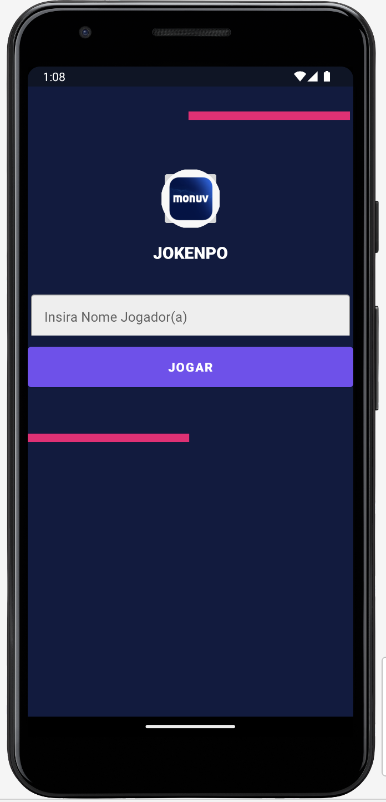
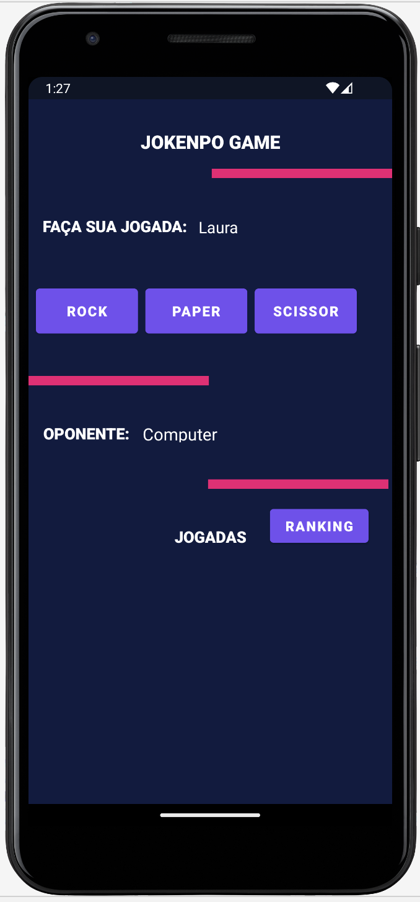
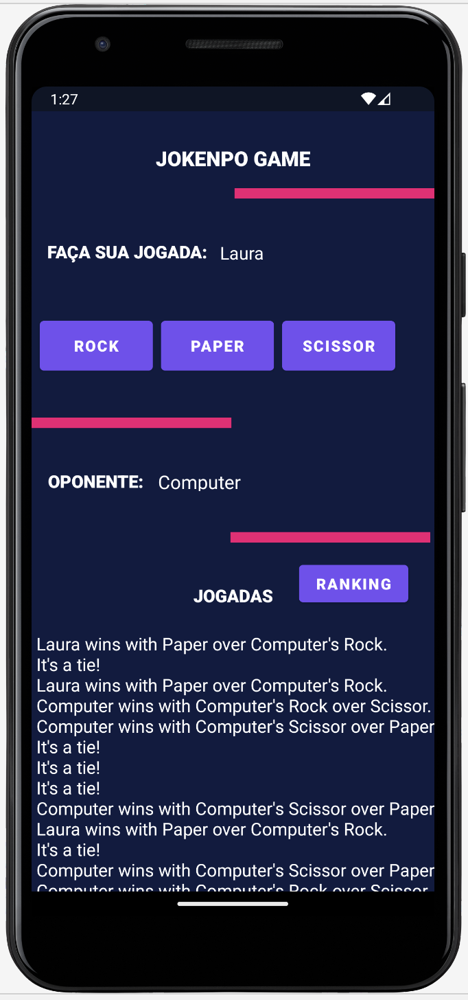
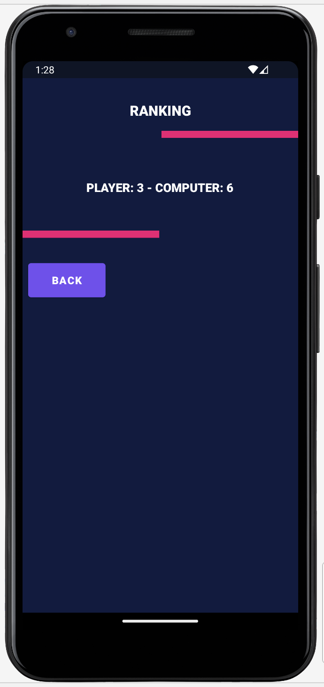

# Jokenpo App (pt-br)

Jokenpo App é um **Aplicativo Android** que visa **simular o jogo jokenpo (pedra, papel e tesoura)**.

## Objetivo 

**Criar uma solução digital para o jogo original jokenpo**, de modo que possa ser jogado em dispositivos android.

### 💻Tecnologias:
* Android;
* Kotlin;
* Android SDK;
* Arquitetura MVC;
* UI/UX Concepts;
* Material Design;
* XML & Constraintlayout;
* Gradle.

### 🛠️Tools:
* Git/Github;
* Android Studio.

### ⏱️Metodologias Ágeis:
• Kanban.

### Status: Em Desenvolvimento

### Checkout on Playstore: 

## Telas

  
  
  
  
 

 
 Quer tirar sua ideia do papel e tranformar em um aplicativo? <a href="https://linktr.ee/Laura_Oliveira"> **Clique Aqui** </a>
-------------------------------------------------------------------------------------------------------------------------------------------

# Jokenpo App (en)

Jokenpo App is an **Android App** that focus on **simulate the jokenpo game (rock, paper, scissors)**.

To **create a digital solution for the original game**.

## Goal

**Create a digital solution for the original jokenpo game**, so that it can be played on android devices.

### 💻Technologies:
* Android;
* Kotlin;
* Android SDK;
* Arquitetura MVC;
* UI/UX Concepts;
* Material Design;
* XML & Constraintlayout;
* Gradle.

### 🛠️Tools:
* Git/Github;
* Android Studio.

### ⏱️Agile Methodologies:
* Kanban.

### Status: On Going.

### Checkout on Playstore: 

## Screens

  
  
  
  
 

Do you want to build your mobile app? <a href="https://linktr.ee/Laura_Oliveira"> **Click Here** </a>
-------------------------------------------------------------------------------------------------------------------------------------------
